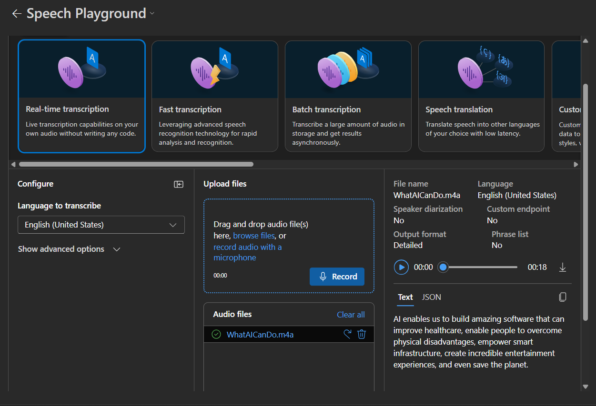
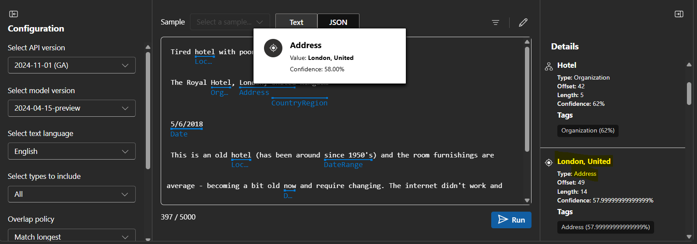
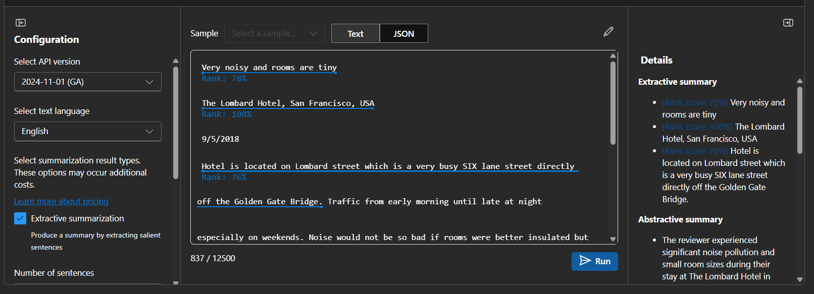

# Processamento de Texto com IA da Azure  

Este repositório contém um projeto prático desenvolvido durante o curso de Inteligência Artificial da Azure na DIO. O objetivo deste projeto é explorar e aplicar conceitos como transcrição em tempo real, resumo de textos e conversão de texto em avatar de fala.  

## 📌 Estrutura do Projeto  

📂 `inputs/` - Contém um documento de texto com sentenças utilizadas na análise.  
📂 `output/` - Contém prints e resultados dos testes realizados.  
📄 `README.md` - Documentação do projeto, insights e aprendizados.  

## 🚀 Processo de Desenvolvimento  

1. **Transcrição em Tempo Real (Real-time Transcription)**  
   - Utilizamos o serviço de transcrição da Azure para converter fala em texto em tempo real.  
   - Testamos diferentes cenários, como transcrição de uma conversa e de um áudio previamente gravado.  

2. **Resumo de Texto (Summarize Text)**  
   - Enviamos textos longos para a API da Azure, que gerou resumos concisos e objetivos.  
   - Comparação entre o texto original e o resumo gerado.  

3. **Texto para Avatar de Fala (Text to Speech Avatar)**  
   - Criamos um avatar falante que interpreta o texto enviado.  
   - Fiz uma brincadeira com minha filha, utilizando frases divertidas para testar a funcionalidade.  

## 📸 Exemplos e Resultados  

### 🎙️ Exemplo de Transcrição em Tempo Real  
Áudio original:  
🔊 [Clique para ouvir](inputs/WhatAICanDo.m4a)  

Texto transcrito:  
  

---

### 📄 Exemplo de extração de informações
  

---

### 📄 Exemplo de Resumo de Texto  
  

---

### 🎭 Exemplo de Texto para Avatar de Fala  
Nesse caso testei fazendo uma brincadeira com minha filha, ela não deu muita bola mas eu achei incrível 😅

🎥 [Clique para assistir](output/video.mp4)

---

## 📌 Insights e Possibilidades  

- A transcrição em tempo real pode ser aplicada em reuniões, legendas automáticas e assistentes virtuais.
- A Extração de informações pode ser usado para classificar e organizar documentos e seus parâmetros.
- A geração automática de resumos é útil para otimizar a leitura de grandes volumes de texto.  
- O Text to Speech Avatar pode ser aplicado em educação, acessibilidade e entretenimento.  

## 🔗 Links Úteis  

- [Laboratório de Transcrição de Áudio](https://microsoftlearning.github.io/mslearn-ai-fundamentals/Instructions/Labs/09-speech.html)  
- [Laboratório de Resumo de Texto](https://microsoftlearning.github.io/mslearn-ai-fundamentals/Instructions/Labs/06-text-analysis.html)  
